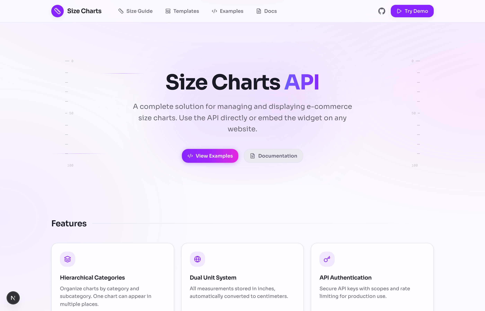
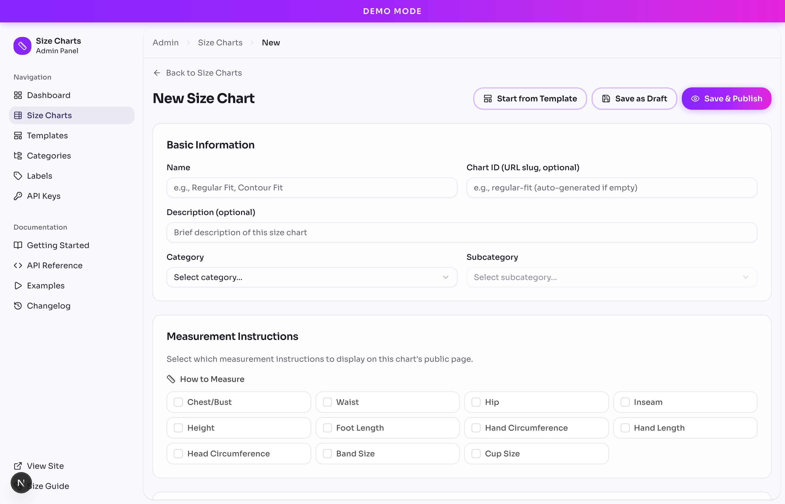

<div align="center">

# Size Charts

**Open-source size chart management for e-commerce**

[](https://www.sizecharts.dev)
[](LICENSE)
[](https://github.com/mattdecrevel/size-charts)

[Live Demo](https://www.sizecharts.dev) · [Documentation](https://www.sizecharts.dev/docs) · [Report Bug](https://github.com/mattdecrevel/size-charts/issues)

</div>

---

A production-ready size chart system with an admin panel, REST API, and embeddable widget. Built for e-commerce platforms that need to manage clothing, footwear, and accessory sizing.

<div align="center">



</div>

## Features

| Feature | Description |
|---------|-------------|
| **Spreadsheet Editor** | Excel-like editing with keyboard navigation |
| **Multi-Category** | One chart can appear in multiple categories |
| **Dual Units** | All measurements in inches + centimeters |
| **REST API** | Full CRUD with OpenAPI documentation |
| **Embeddable Widget** | One script tag, zero dependencies |
| **API Keys** | Scoped authentication with rate limiting |
| **Dark Mode** | Full dark mode support |
| **Templates** | Pre-built charts for common use cases |

<div align="center">



*Spreadsheet-style editor with inline editing and keyboard navigation*

</div>

## Quick Start

### Option 1: Deploy to Vercel (Recommended)

[](https://vercel.com/new/clone?repository-url=https://github.com/mattdecrevel/size-charts&env=DATABASE_URL&envDescription=PostgreSQL%20connection%20string&envLink=https://github.com/mattdecrevel/size-charts%23environment-variables)

1. Click the button above
2. Connect a PostgreSQL database ([Neon](https://neon.tech), [Supabase](https://supabase.com), or [Railway](https://railway.app))
3. Set `DATABASE_URL` environment variable
4. Deploy!

### Option 2: Local Development

```bash
# Clone and install
git clone https://github.com/mattdecrevel/size-charts.git
cd size-charts
npm install

# Setup database
cp .env.example .env
# Edit .env with your DATABASE_URL

# Initialize and seed
npm run db:push
npm run db:seed

# Start dev server
npm run dev
```

Open [http://localhost:3000](http://localhost:3000)

## Usage

### Embed Widget

Add size charts to any website with one script tag:

```html
<div data-chart="mens-tops"></div>
<script src="https://www.sizecharts.dev/embed/size-charts.js"
        data-api="https://www.sizecharts.dev">
</script>
```

### REST API

```bash
# Get all size charts
curl https://www.sizecharts.dev/api/v1/size-charts

# Get specific chart
curl https://www.sizecharts.dev/api/v1/size-charts?slug=mens-tops

# With authentication (when enabled)
curl -H "X-API-Key: sc_live_xxxx" \
  https://www.sizecharts.dev/api/v1/size-charts
```

See [API Documentation](https://www.sizecharts.dev/docs/api) for all endpoints.

## Tech Stack

- **Framework**: [Next.js 16](https://nextjs.org/) (App Router)
- **Language**: [TypeScript 5](https://www.typescriptlang.org/)
- **Database**: [PostgreSQL](https://www.postgresql.org/) + [Prisma 7](https://www.prisma.io/)
- **Styling**: [Tailwind CSS 4](https://tailwindcss.com/) + [shadcn/ui](https://ui.shadcn.com/)
- **State**: [TanStack Query](https://tanstack.com/query)

## Environment Variables

| Variable | Required | Description |
|----------|----------|-------------|
| `DATABASE_URL` | Yes | PostgreSQL connection string |
| `DEMO_MODE` | No | Enable public demo mode (`true`/`false`) |
| `ADMIN_USERNAME` | No | Admin panel username (if not demo mode) |
| `ADMIN_PASSWORD` | No | Admin panel password (if not demo mode) |
| `API_AUTH_REQUIRED` | No | Require API key authentication |
| `CORS_ALLOWED_ORIGINS` | No | Allowed CORS origins (comma-separated) |

See [.env.example](.env.example) for all options.

## Project Structure

```
app/
├── (marketing)/     # Landing page, docs, examples
├── (app)/
│   ├── admin/       # Admin panel
│   └── size-guide/  # Public size guide
└── api/
    ├── v1/          # Public REST API
    └── admin/       # Admin endpoints

components/
├── admin/           # Admin UI components
├── public/          # Public-facing components
└── ui/              # shadcn/ui components

prisma/
├── schema.prisma    # Database schema
├── seed.ts          # Sample data
└── templates/       # Chart templates
```

## Development

```bash
npm run dev          # Start dev server
npm run build        # Production build
npm run lint         # Run linter
npm run typecheck    # Type check
npm run test:run     # Run tests
npm run test:e2e     # Run E2E tests
npm run db:studio    # Open Prisma Studio
npm run build:analyze # Analyze bundle size
```

## Self-Hosting

This project is designed to be self-hostable. To run as a standalone service:

1. **Remove marketing content** (optional):
   - Delete `app/(marketing)/` for a minimal installation
   - The admin panel, API, and size guide will continue to work

2. **Configure authentication**:
   - Set `DEMO_MODE=false`
   - Set `ADMIN_USERNAME` and `ADMIN_PASSWORD`
   - Optionally enable `API_AUTH_REQUIRED=true`

3. **Deploy**:
   - Docker: `docker build -t size-charts . && docker run -p 3000:3000 size-charts`
   - Node: `npm run build && npm start`

## Contributing

Contributions are welcome! Please see [CONTRIBUTING.md](CONTRIBUTING.md) for guidelines.

1. Fork the repository
2. Create a feature branch: `git checkout -b feature/my-feature`
3. Make your changes
4. Run tests: `npm run test:run && npm run lint`
5. Submit a pull request

## License

MIT License - see [LICENSE](LICENSE) for details.

---

<div align="center">

**[Website](https://www.sizecharts.dev)** · **[Documentation](https://www.sizecharts.dev/docs)** · **[GitHub](https://github.com/mattdecrevel/size-charts)**

Built with [Next.js](https://nextjs.org/) · UI by [shadcn/ui](https://ui.shadcn.com/) · Database by [Prisma](https://www.prisma.io/)

</div>
